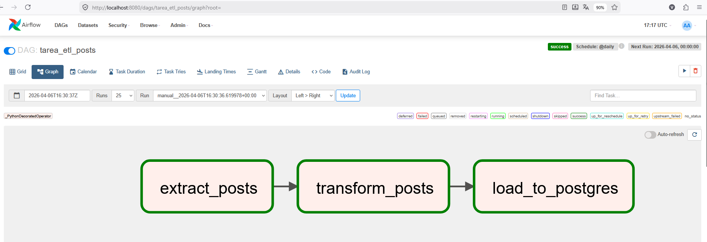
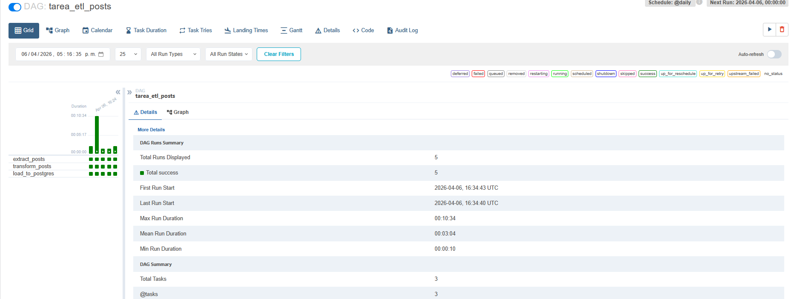
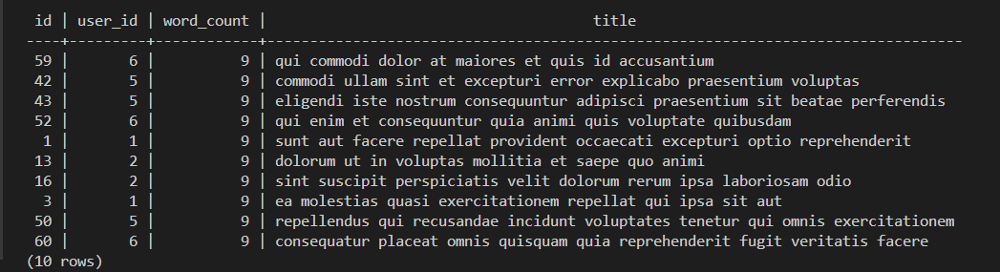

# Pipeline ETL Orquestado con Apache Airflow

**Herramienta principal:** Apache Airflow (TaskFlow API)

---

## Descripción general

Este proyecto implementa un pipeline ETL completo y automatizado que extrae datos de una API pública REST, aplica una transformación basada en reglas de negocio y persiste los resultados en una base de datos relacional PostgreSQL. Todo el flujo está orquestado por Apache Airflow corriendo en contenedores Docker.

---

## Tecnologías utilizadas

| Componente | Tecnología |
|---|---|
| Orquestador | Apache Airflow 2.x (TaskFlow API) |
| Lenguaje | Python 3.x |
| Base de datos | PostgreSQL |
| Infraestructura | Docker & Docker Compose |
| Librerías | `requests`, `apache-airflow-providers-postgres` |
| API fuente | JSONPlaceholder (`/posts`) |

---

## Arquitectura del Pipeline (DAG)

El DAG se llama `tarea_etl_posts` y está compuesto por tres tareas conectadas de forma secuencial. Los datos viajan entre tareas usando **XComs** (mecanismo nativo de Airflow para pasar valores entre tasks).

```
[JSONPlaceholder API]
        │
        ▼
┌──────────────────┐
│  extract_posts() │  → GET https://jsonplaceholder.typicode.com/posts
│     @task        │    Valida HTTP 200, retorna lista de dicts JSON
└──────┬───────────┘
       │  XCom (100 posts)
       ▼
┌──────────────────────┐
│  transform_posts()   │  → Filtra posts: len(title.split()) > 5
│     @task            │    Agrega campo calculado: word_count
└──────┬───────────────┘
       │  XCom (posts filtrados)
       ▼
┌──────────────────────────┐
│   load_to_postgres()     │  → CREATE TABLE IF NOT EXISTS posts_filtered
│        @task             │    TRUNCATE → INSERT rows via PostgresHook
└──────────────────────────┘
        │
        ▼
[PostgreSQL: tabla posts_filtered]
```





### Estructura del proyecto

```
proyecto-etl-airflow/
│
├── dags/
│   └── tarea_etl_dag.py       # DAG principal con las 3 tasks
│
├── docker-compose.yaml        # Servicios: Airflow + PostgreSQL
└── README.md
```

---

## Detalle de cada tarea

### 1. `extract_posts()` — Extracción

- Realiza un `GET` a `https://jsonplaceholder.typicode.com/posts`.
- Usa `response.raise_for_status()` para validar que la respuesta HTTP sea exitosa (código 200).
- Retorna la lista completa de 100 posts como lista de diccionarios Python.
- El resultado queda disponible vía **XCom** para la siguiente tarea.

### 2. `transform_posts(posts)` — Transformación

- Recibe la lista de posts extraídos vía XCom.
- **Regla de negocio aplicada:** solo se conservan posts cuyo título tiene más de 5 palabras (`word_count > 5`).
- Calcula y agrega el campo derivado `word_count = len(title.split())` a cada registro filtrado.
- Normaliza los nombres de campo (`userId` → `user_id`) para alinearlos con el esquema de la base de datos.
- Imprime en log el resultado del filtrado (cuántos posts pasaron la condición).

**Esquema de salida por registro:**

```python
{
    'id':         int,   # ID original del post
    'user_id':    int,   # ID del usuario autor
    'title':      str,   # Título del post
    'body':       str,   # Cuerpo del post
    'word_count': int,   # Cantidad de palabras en el título
}
```

### 3. `load_to_postgres(posts)` — Carga

- Usa `PostgresHook(postgres_conn_id='postgres_datapath')` para manejar la conexión a la base de datos sin exponer credenciales en el código.
- Ejecuta un `CREATE TABLE IF NOT EXISTS posts_filtered (...)` para garantizar que la tabla exista.
- Aplica `TRUNCATE TABLE posts_filtered` antes de cada carga para evitar duplicados (idempotencia).
- Inserta todos los registros de una vez con `pg_hook.insert_rows(...)` apuntando a los campos `['id', 'user_id', 'title', 'body', 'word_count']`.
- Registra en log cuántas filas fueron insertadas exitosamente.

**DDL de la tabla destino:**

```sql
CREATE TABLE IF NOT EXISTS posts_filtered (
    id         INT PRIMARY KEY,
    user_id    INT,
    title      TEXT,
    body       TEXT,
    word_count INT
);
```

---

## Configuración del DAG

```python
default_args = {
    'owner':           'Frank',
    'depends_on_past': False,
    'start_date':      days_ago(1),
    'retries':         1,
    'retry_delay':     timedelta(minutes=5),
}

@dag(
    dag_id='tarea_etl_posts',
    schedule_interval='@daily',
    catchup=False,
    tags=['tarea', 'etl']
)
```

| Parámetro | Valor | Significado |
|---|---|---|
| `schedule_interval` | `@daily` | Se ejecuta automáticamente una vez por día |
| `catchup` | `False` | No ejecuta ejecuciones pendientes del pasado |
| `retries` | `1` | Si una tarea falla, reintenta 1 vez |
| `retry_delay` | `5 min` | Espera 5 minutos antes de reintentar |
| `depends_on_past` | `False` | No depende del estado de la ejecución anterior |

---

## Ejecución del proyecto

### Requisitos previos

- Docker Desktop instalado y corriendo
- Docker Compose disponible

### Pasos

```bash
# 1. Clonar o ubicarse en el directorio del proyecto
cd proyecto-etl-airflow/

# 2. Levantar todos los servicios
docker-compose up -d

# 3. Esperar ~60 segundos a que Airflow inicialice
# 4. Abrir la UI de Airflow
open http://localhost:8080
# Credenciales: airflow / airflow

# 5. Activar el DAG "tarea_etl_posts" desde la UI (toggle ON)
# 6. Triggerear manualmente o esperar la ejecución diaria
```

### Verificar la carga en PostgreSQL

```sql
-- Conectarse al contenedor de PostgreSQL
docker exec -it <postgres_container> psql -U airflow -d airflow

-- Ver los datos cargados
SELECT id, user_id, word_count, title
FROM posts_filtered
ORDER BY word_count DESC
LIMIT 10;

-- Ver el total de registros
SELECT COUNT(*) FROM posts_filtered;
```

---



## Resultados obtenidos

- Pipeline ETL completamente automatizado y orquestado con Airflow.
- Las 3 tareas (`extract_posts`, `transform_posts`, `load_to_postgres`) ejecutan en verde sin errores.
- Se aplica correctamente el filtro de negocio: de 100 posts originales, solo se persisten aquellos con título de más de 5 palabras.
- La tabla `posts_filtered` se actualiza de forma idempotente en cada ejecución (TRUNCATE + INSERT).
- Se utilizó `PostgresHook` para gestionar la conexión a la base de datos de forma segura, sin hardcodear credenciales.
- Código limpio y modular gracias al uso de decoradores `@dag` y `@task` (TaskFlow API).
- Los datos viajan entre tareas usando XComs, mecanismo nativo de Airflow.

---

## Decisiones técnicas destacadas

**¿Por qué TaskFlow API y no el operador clásico?**  
La TaskFlow API (`@dag`, `@task`) permite escribir el pipeline como funciones Python puras, haciendo que el paso de datos entre tareas (XComs) sea implícito y legible. El código es más mantenible que usar `PythonOperator` explícito.

**¿Por qué TRUNCATE antes de INSERT?**  
Garantiza idempotencia: si el DAG se re-ejecuta por un fallo o manualmente, no se acumulan duplicados en la tabla destino.

**¿Por qué PostgresHook en vez de una conexión directa?**  
`PostgresHook` lee las credenciales desde las Connections de Airflow (configuradas en la UI o por variable de entorno), lo que respeta las buenas prácticas de seguridad y portabilidad.
